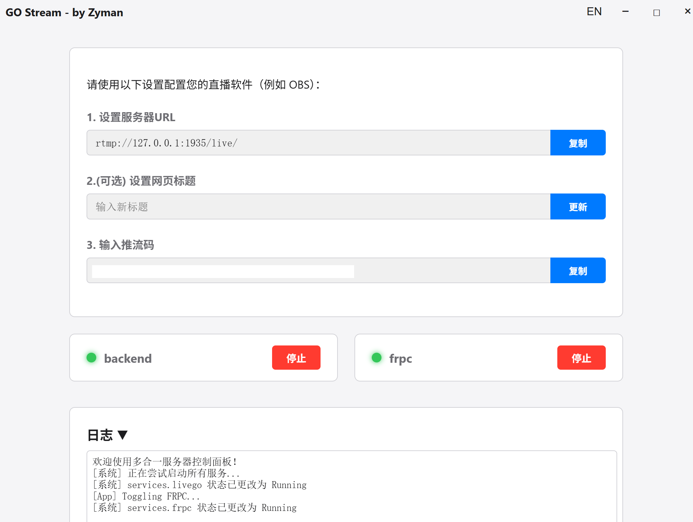
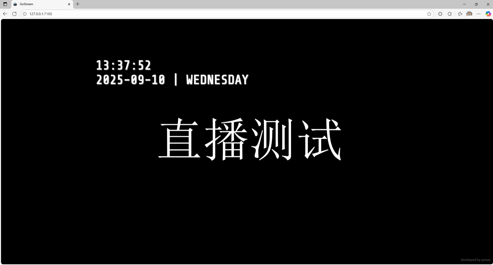

# GO stream

<div align="center">
  
  <br/><br/>
  <p>一个简洁的桌面应用，用于启动您自己的直播推流服务。</p>
  <p>
    
    
    
  </p>
</div>

---

## 📖 关于

您是否曾想和朋友进行一场高质量的游戏直播，或进行一次超低延迟的屏幕共享，却不希望在公开直播平台上被陌生人围观？

虽然钉钉、腾讯会议等工具可以满足基本的屏幕共享需求，但当您追求更高的画质、更低的延迟和更强的私密性时，往往会发现选择寥寥。要么忍受通用会议软件的延迟和画质压缩，要么只能在公开平台进行直播。

为了解决这个痛点，**GoStream** 诞生了。它是一个开源的简洁桌面应用，让您能轻松启动并管理自己的专属直播推流服务。

本项目基于 [LiveGo](https://github.com/gwuhaolin/livego) 开发的桌面应用程序，使用 [Wails](https://wails.io) 和 [Svelte](https://svelte.dev/) 构建。它通过一个直观的图形化界面，为个人主播或小型团队提供了一套简单易用的直播推流解决方案。

只需运行一个程序，即可在局域网内（如校园网、公司内网）开启稳定、高质量的直播服务。此外，项目还无缝集成了 `frpc`（内网穿透），当您需要时，可以轻松地将直播流分享到公网，让任何地方的朋友都能方便观看。


## 💡 如何使用



1.  **启动应用**: 打开 `GoStream.exe`。

2.  **开启服务**: 在 "Backend" 部分，点击 **启动** 按钮，后台推流服务即刻运行。

3.  **获取信息**: 服务启动后，界面会自动生成并显示推流服务器地址和推流码。

4.  **配置推流软件**: 打开 OBS 等推流工具，将界面上显示的 **服务器地址** 和 **推流码** 复制并填入相应设置中。

5.  **开始直播**: 在推流软件中开始推流。

    *   **局域网观看**: 在同一局域网下的任何设备上，打开浏览器并访问 `http://[你的本机IP]:7180` 即可观看。

    *   **公网观看**: 如果配置了内网穿透，启动FRP，访问您的FRP公网地址即可。

6.  **(可选) 自定义标题**: 在 **“设置直播网页标题”** 输入框中填入您想要的标题，然后点击 **更新**。




## ⚙️ 内网穿透FRPC配置 (可选)

如果希望将直播分享给不在同一局域网的观众，您需要配置内网穿透（FRP）。如果仅在内网使用，请跳过此步骤。

内网穿透可以尝试[Passnat](https://dashboard.passnat.com/reg?aff=QjeMTK)，下载默认配置文件即可。


**配置步骤**:

1.  在 `GoStream.exe` **所在的目录**下，创建一个名为 `frpc.toml` 或 `frpc.ini` 的配置文件。

2.  将您的 FRP 服务商提供的配置信息填入该文件。请确保将本地的网页服务端口 `7180` 映射出去。

以下是一个 `frpc.toml` 的配置示例，它演示了如何将本地 `7180` 端口映射到公网：

    ```toml
    # frpc.toml 示例
    serverAddr = "your_frp_server_ip"
    serverPort = "server_port"
    auth.token = "your_auth_token"

    [[proxies]]
    name = "your_name_tcp"
    type = "tcp"
    localIP = "127.0.0.1"
    localPort = 7180
    remotePort = 6000

    [[proxies]]
    name = "your_name_http"
    type = "http"
    localIP = "127.0.0.1"
    localPort = 7180
    customDomains = ["gostream.com"]

    ```
**重要端口说明**:

*   **网页服务 (观看直播)**: 默认端口 `7180`。您需要为这个端口设置FRP映射。

*   **RTMP推流**: 默认端口 `1935`。通常您只需要在局域网内推流，因此该端口无需映射到公网。

## ✨ 功能特性

- **单一服务控制**: 图形化界面一键控制所有后台服务 (`livego` 和 `frpc`) 的启停。
- **智能内网穿透**: 自动检测同目录下的 `frpc` 配置文件，存在即启动 `frpc` 服务。
- **自定义页面标题**: 在应用内直接修改直播网页的标题。
- **多语言支持**: 内置中/英文切换。
- **跨平台**: 基于 Wails 构建，可打包为 Windows, macOS 和 Linux 应用。

## ⚙️ 开发计划

- [x] 合并FRPC内网穿透
- [ ] 支持WebRTC 

## 🔧 开发

如需进行二次开发，请确保您已安装 Go, Node.js 和 Wails。

在项目根目录运行 `wails dev`。这将启动一个 Vite 开发服务器，提供前端的快速热重载。您也可以在浏览器中访问 `http://localhost:34115` 来调用 Go 的方法进行调试。


运行 `wails build` 来构建一个可分发的、生产环境的软件包。

## ⚠️ 重要：安全与合规性注意事项

当您使用可选的 **内网穿透 (FRP)** 功能时，您的本地直播服务（默认使用  `7180` 网页端口）将被暴露在公共互联网上。这意味着任何人都可以通过您的公网地址访问您的直播内容。

请在启用此功能前，仔细阅读并理解以下几点：

### 安全风险与隐私保护

*   **公网暴露**: 一旦启用FRP，您的直播流将不再局限于本地网络。请确保您直播的内容适合公开传播，并注意保护个人隐私和敏感信息。
*   **FRP服务器安全**: 您有责任确保所使用的FRP服务器是安全可靠的。
*   **资源滥用**: 公开的服务可能会被恶意使用，消耗您的带宽和服务器资源。请监控您的服务状态。

### 法律法规与内容合规

您必须为通过本应用发布的所有内容负全部责任。请严格遵守以下规定：

*   **遵守法律**: 严格遵守您所在国家及服务所在地的法律法规、行业惯例和社会公共道德。
*   **禁止内容**: 严禁发布任何违反法律法规的内容，包括但不限于：
    *   涉及国家秘密或安全的信息。
    *   任何形式的黑客攻击、网络破坏行为。
    *   妨碍互联网运行安全或侵犯他人合法权益的信息。